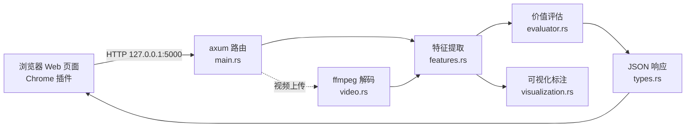

# 🖼️ 智能图像算力调度系统（image-scheduler-rs）

> **用最低的成本、最快的速度，在「本地（快但弱）」和「云端（强但慢）」之间，精准判断「哪张图值得送给谁」。**

基于 Rust 的端-云协同图像调度系统。核心思路：不是每帧都送云端（太慢太贵），也不是全放本地（算力不够看不清），而是先在本地用**毫秒级**的 10 维特征提取把图片「量化打分」，分数高的送云端、中等的本地处理、平淡的直接丢弃。

系统已跑通完整闭环：**前端上传 → 后端打分 → 显示决策 → 一键 EXE → Chrome 插件实时分析正在播放的视频**。

---

## ✨ 核心特性

| 特性 | 说明 |
| :--- | :--- |
| 🧮 **10 维特征提取** | 香农熵、Sobel 边缘、滑动窗口峰值、下半区优势、轮廓统计、HSV 色相丰富度、帧间 motion 等，全部在 128×128 缩略图上计算，单帧毫秒级 |
| 📊 **可解释打分** | 9 项权重加权求和 + 亮度分段惩罚，输出 0~1 价值分；阈值 0.72 → CLOUD / 0.38 → LOCAL / 其余 DROP |
| 🎬 **两阶段视频分析** | 先 64×64 轻量检测筛出关键帧（运动突变/亮度突变），再对关键帧用 rayon 并行做完整分析，长视频也扛得住 |
| ⚙️ **一处调参** | 所有阈值、权重、采样参数集中在 [`src/config.rs`](src/config.rs)，调参不用翻算法代码 |
| 🖥️ **三种入口** | Web 页面、EXE 双击运行、Chrome 插件实时分析 |
| 📈 **可视化** | 边缘/轮廓/峰值窗口标注图、熵值随时间折线、逐帧决策分布条、六维指标趋势图 |

---

## 🚀 快速开始

### 方式一：直接下载（推荐，无需编译）

从 **[Releases](https://github.com/fanqin314/image-scheduler-rs/releases)** 下载两个文件：

| 文件 | 用途 |
| :--- | :--- |
| `image-scheduler-rs.exe` | 本地后端服务（双击即运行，自动打开浏览器） |
| `realtime-extension-vX.X.X.zip` | Chrome 实时分析插件（解压后加载） |

**安装步骤：**

1. 双击 `image-scheduler-rs.exe` 启动后端，浏览器自动打开 `http://127.0.0.1:5000`（保持它在后台运行）
2. 解压插件 zip → `chrome://extensions` → 开启「开发者模式」→「加载已解压的扩展程序」→ 选择解压出的文件夹
3. **可选（自动启停后端）**：双击插件目录里的 `install_native_host.bat` 注册 Native Host，之后插件可自动启动/停止后端，无需手动开 exe

> 💡 插件原理：插件通过 `127.0.0.1:5000` 直连本地后端。后端 exe 启动后插件即可用；Native Host 只是"自动启停"的加分项，不注册也能用（手动开 exe 即可）。

### 方式二：源码编译运行

```bash
cargo build --release
./target/release/image-scheduler-rs.exe
```

启动后自动打开浏览器访问 `http://127.0.0.1:5000`，首次运行会自动下载 ffmpeg（~30MB，用于视频解码）。

### 使用方式

- **图片分析**：上传图片 → 查看 10 维特征、价值分、调度决策（CLOUD/LOCAL/DROP）和特征标注图
- **视频分析**：上传视频 → 自动抽帧分析，返回逐帧决策摘要、熵值曲线、决策分布图，支持导出
- **Chrome 实时分析**：分析任意网站正在播放的视频（见下文插件说明）

---

## 🏗️ 系统架构



| 模块 | 职责 |
| :--- | :--- |
| `config.rs` | **全局调参中心**：特征参数、评估权重、决策阈值、视频采样参数 |
| `features.rs` | 图像 → 10 维特征向量（熵 / Sobel / 滑动窗口 / 轮廓 / HSV） |
| `evaluator.rs` | 特征 → 价值分 0~1 → 决策 CLOUD / LOCAL / DROP |
| `handlers.rs` | Web 路由：图片上传、视频两阶段分析、实时帧分析 |
| `video.rs` | ffmpeg-sidecar 逐帧解码，自动采样最多 60 帧 |
| `visualization.rs` | 生成标注图（边缘/网格/轮廓/峰值窗口/下半区） |
| `types.rs` | 前后端 API 数据结构定义 |

---

## 🧠 特征与决策

### 10 维特征

| 特征 | 取值范围 | 含义 |
| :--- | :--- | :--- |
| `entropy` 香农熵 | 0~8 | 灰度分布随机性（纯色→0，随机→8） |
| `edge_ratio` 全局边缘占比 | 0~1 | 画面内容丰富度 |
| `brightness` 平均亮度 | 0~1 | 0=纯黑，1=纯白（仅作惩罚项） |
| `local_peak` 局部峰值 | 0~1 | 最密集窗口的边缘密度，捕捉局部主体 |
| `local_variance` 局部离散度 | 0~∞ | 窗口边缘密度方差（疏密对比） |
| `lower_advantage` 下半区优势 | 0~∞ | 路面/车辆 vs 天空（车行场景特化） |
| `motion` 帧间运动 | 0~∞ | 相邻帧像素差均值（视频流时生效） |
| `contour_count` 轮廓数量 | 0~∞ | 场景复杂度 |
| `contour_area_variance` 轮廓面积方差 | 0~∞ | 物体大小是否多样 |
| `color_richness` 颜色丰富度 | 0~1 | HSV 色相覆盖 12 个 bin 的广度 |

### 决策规则

```
价值分 ≥ 0.72  →  CLOUD  画面复杂/价值高，值得送云端做完整识别
价值分 ≥ 0.38  →  LOCAL  画面适中，本地轻量分析即可
价值分 < 0.38  →  DROP   画面平淡，直接跳过
```

打分 = Σ(9 项权重 × 归一化特征) × 亮度惩罚，权重总和恒为 1.0，详见 [`config.rs`](src/config.rs)。

---

## 🌐 Chrome 实时视频分析插件

`realtime-extension/` 是一个 MV3 浏览器插件，可**实时解析任意网站正在播放的视频**：

1. 打开 `chrome://extensions` → 开启「开发者模式」→「加载已解压的扩展程序」→ 选择 `realtime-extension/` 目录
2. 注册 Native Host（Windows 注册表写入 `com.video.analyzer.json` 的路径，用于插件自动启停本地后端）
3. 打开任意视频网站（B 站/YouTube 等）→ 点击扩展图标 → 「开始分析」

插件能力：穿透 Shadow DOM / iframe 自动发现视频、500ms 节流截帧、六维指标实时曲线、评分仪表条、决策统计、分析日志导出 JSON。

---

## 📦 项目结构

```
image-scheduler-rs/
├── src/                      # Rust 后端
│   ├── main.rs               # 服务入口（axum 路由）
│   ├── config.rs             # 全局可调参数中心
│   ├── features.rs           # 10 维特征提取
│   ├── evaluator.rs          # 价值评估与决策
│   ├── handlers.rs           # Web 路由处理器
│   ├── video.rs              # ffmpeg 视频解码
│   ├── visualization.rs      # 标注图生成
│   └── types.rs              # 数据结构定义
├── templates/
│   └── index.html            # 前端页面（编译进 EXE）
├── realtime-extension/       # Chrome 实时分析插件
├── samples/                  # 测试图片
└── Cargo.toml
```

---

## 🗺️ 路线图

| 阶段 | 状态 |
| :--- | :--- |
| 0. 终端跑通特征提取与打分 | ✅ 完成 |
| 1. Web 界面 + EXE + 可视化 | ✅ 完成 |
| 2. 视频流分析，motion 真正生效 | ✅ 完成（两阶段关键帧分析） |
| 3. 决策真正调用本地 ONNX / 云端 API | 🔜 下一个目标 |
| 4. 反馈闭环：抽样回灌 + 日志分析自动校准阈值 | 长期目标 |
| 5. 语义识别：画面里有树/车/人（当前仅量化特征） | 规划中 |

---

## 🧩 技术栈

Rust · axum · tokio · rayon · image/imageproc · ffmpeg-sidecar · Chrome Extension (MV3) · Native Messaging
